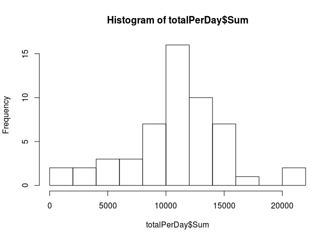
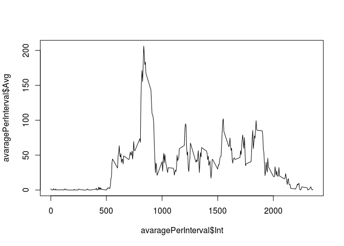
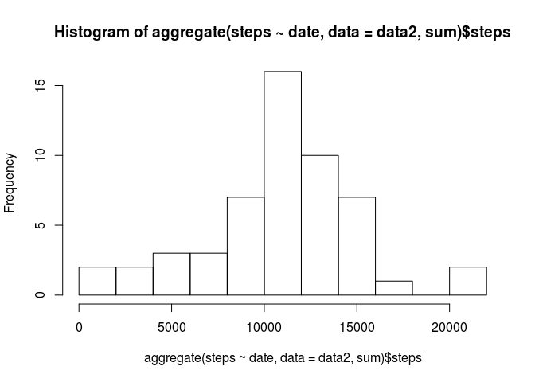
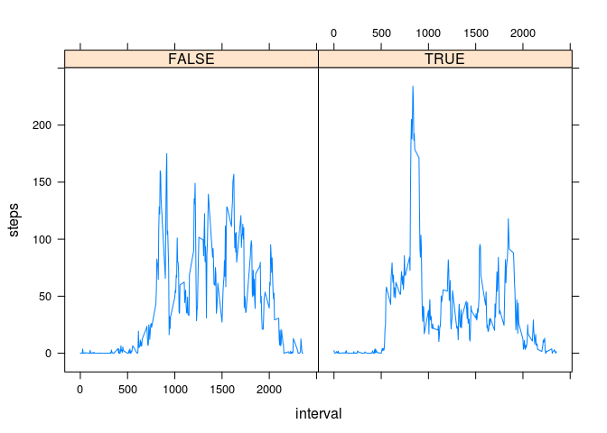
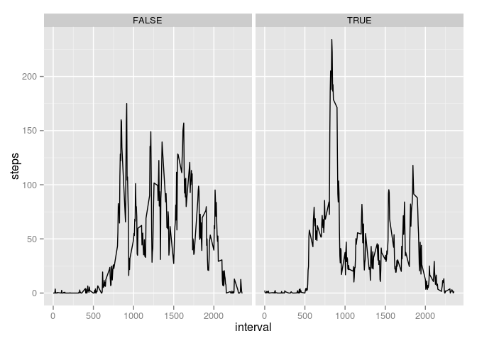

# Reproducible Research: Peer Assessment 1


## Loading and preprocessing the data

To process this data;

* we should extract the csv file from the zip file with _unzip_ function

* read the csv file with _read.csv_ function

* eliminate the NA values with the help of _complete.cases_ function


```r
data<-read.csv(unzip("activity.zip", "activity.csv"))
data<-data[complete.cases(data),]
```

Now we have preprocessed data.

## What is mean total number of steps taken per day?

To answer this question;

* we should calculate the total number of steps per day

* calculate the mean


```r
totalPerDay<-aggregate(data$steps, by=list(data$date), FUN=sum)
names(totalPerDay) <- c("Date", "Sum") # we are re-naming the columns
mean(totalPerDay$Sum)
```

```
## [1] 10766.19
```

```r
median(totalPerDay$Sum)
```

```
## [1] 10765
```

By plotting histogram of the total number of steps taken each day, we can verify median and mean. You can see that in most of the days, the person has steps between 10000-15000.

```r
hist(totalPerDay$Sum, breaks = 10)
```

 


## What is the average daily activity pattern?


```r
avaragePerInterval<-aggregate(data$steps, by=list(data$interval), FUN=mean)
names(avaragePerInterval)<-c("Int", "Avg")
plot(avaragePerInterval$Int, avaragePerInterval$Avg, type="l")
```

 

Which 5-minute interval, on average across all the days in the dataset, contains the maximum number of steps?

```r
avaragePerInterval$Int[which(avaragePerInterval$Avg==max(avaragePerInterval$Avg))]
```

```
## [1] 835
```

## Imputing missing values
Calculate and report the total number of missing values in the dataset 

```r
data<-read.csv(unzip("activity.zip", "activity.csv"))
length( which(complete.cases(data)==FALSE) )
```

```
## [1] 2304
```

Devise a strategy for filling in all of the missing values in the dataset. The strategy does not need to be sophisticated. For example, you could use the mean/median for that day, or the mean for that 5-minute interval, etc.


```r
m<-mean(data$steps, na.rm = TRUE)
data$steps[is.na(data$steps)]<-m
```

Create a new dataset that is equal to the original dataset but with the missing data filled in.


```r
data1<-read.csv(unzip("activity.zip", "activity.csv"))
data2<-data1[complete.cases(data1),]
```

Make a histogram of the total number of steps taken each day and Calculate and report the mean and median total number of steps taken per day. Do these values differ from the estimates from the first part of the assignment? What is the impact of imputing missing data on the estimates of the total daily number of steps?


```r
hist(aggregate(steps ~ date, data = data2, sum)$steps, breaks = 10)
```

 

```r
mean(data2$steps)
```

```
## [1] 37.3826
```


## Are there differences in activity patterns between weekdays and weekends?

To compare activities we should find avarage steps for each for each interval and weekday(TRUE, FALSE).

* _weekday=TRUE_ means it is a weekday (Monday...Friday)

* _weekday=FALSE_ means it is weekend (Saturday,Sunday)


```r
data2$date<-as.Date(data2$date)
data2$day<-weekdays(data2$date)
data2$weekday<-TRUE
data2$weekday[ data2$day=="Saturday"|data2$day=="Sunday" ] <- FALSE

stepsByIntervalAndWeekday <- aggregate(steps ~ interval + weekday, data = data2, mean)
```

Let's plot data for weekday and weekend with lattice and ggplot2.

```r
library(lattice)
xyplot(steps ~ interval | weekday, data=stepsByIntervalAndWeekday, type="l")
```

 

```r
library(ggplot2)
g <- ggplot(stepsByIntervalAndWeekday, aes(interval, steps))
g + geom_line() + facet_grid(.~weekday)
```

 
